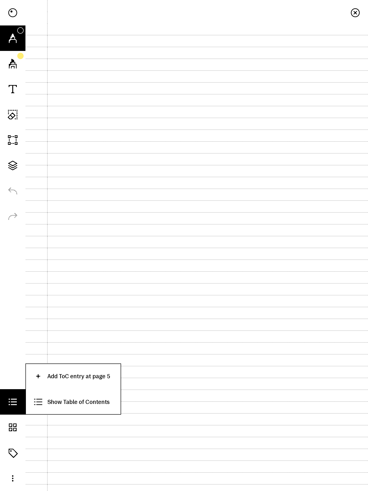
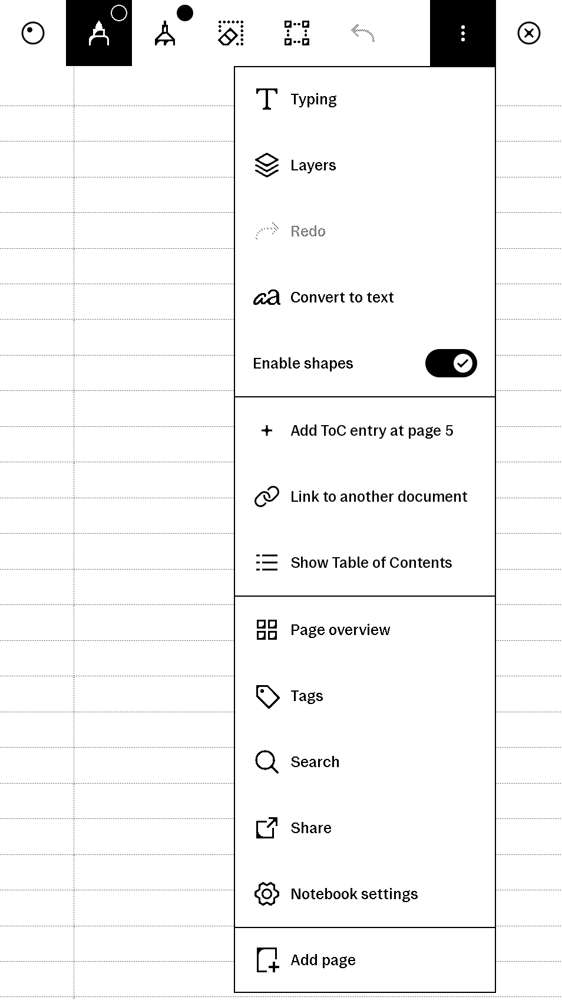
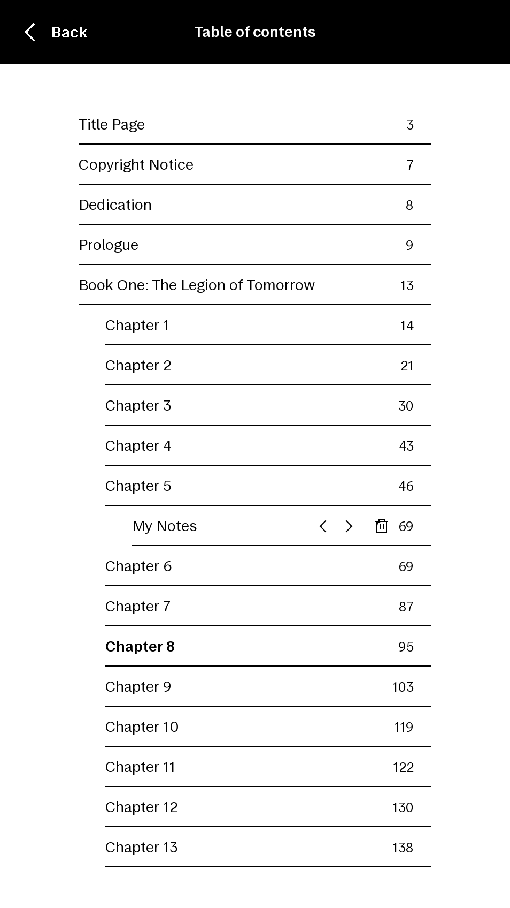

# betterToC

[Video Walkthrough](https://www.youtube.com/watch?v=WlVVxxCql80)

Adds the ability to add, delete*, and edit* Table of Contents entries in notebooks, PDFs, and EPUBs.  
Supports cross-document linking.  
On-disk, ToC data is stored inside the UUID directory for the document in a toc.rm file.  
This syncs between devices via cloud sync.  
EPUB reflows can result in small amounts of drift due to limitations in progress calculation.

<table>
  <tr>
    <td></td>
    <td></td>
    <td></td>
    <td></td>
    <td></td>
  </tr>
</table>

*Editing and deleting are limited to user-created ToC entries only

## Installation

Installation via the [Vellum package manager](https://github.com/vellum-dev/vellum) is recommended. Dependencies are handled automatically.

### Manual

Requires [xovi](https://github.com/asivery/rmpp-xovi-extensions) and qt-resource-rebuilder.

Download `betterToc.qmd` from the [latest release](https://github.com/rmitchellscott/xovi-bettertoc/releases/latest).

Copy to `/home/root/xovi/exthome/qt-resource-rebuilder/` and restart xovi.

## Companion extensions

- [betterTocCollapse](https://github.com/rmitchellscott/xovi-qmd-extensions) — adds chevrons to collapse/expand ToC entries based on indent
- [tocFromSelection](https://github.com/rmitchellscott/xovi-qmd-extensions) — create TOC entries from text selection

## rmhacks migration

rmhacks users can use the `scripts/migrate-bookmarks-to-toc.sh` script to migrate from `.bookm` to `toc.rm` format. `.bookm` files are retained. The script should be executed from the reMarkable tablet, and `chmod +x migrate-bookmarks-to-toc.sh` may be required.
